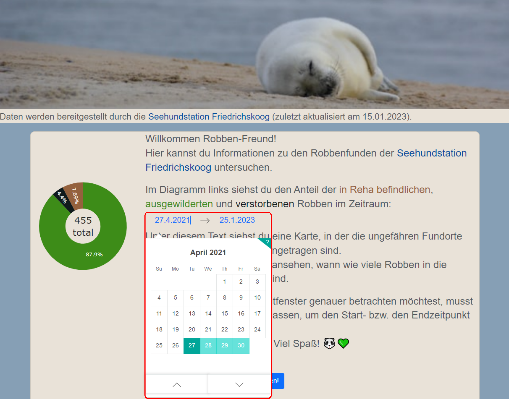

# rob-oliver-app

**Figure 1**: Architecture of the [rob-oliver-app](https://github.com/MirjamKirchner/rob-oliver-app) and
[rob-oliver-data](https://github.com/MirjamKirchner/rob-oliver-data) project

### Table of contents
- [Introduction](#introduction)
- [Visualization application](#visualization-application)
- [Quick start](#quick-start)
- [Learning resources](#learning-resources)

## Introduction
This repository is part of a pet project in which I visualize data about the animal admittances to the [Seehundstation
Friedrichskoog](https://www.seehundstation-friedrichskoog.de/en/) - a seal rescue station in the North of Germany. See
the final result [here](http://where-is-rob-oliver-pandagoesdatascience.eu.pythonanywhere.com/). If you are interested
in learning about the visualization of the pre-processed data in an interactive dashboard, stay here. If you are more
curious about the data pre-processing procedure, please go to the repository
[rob-oliver-data](https://github.com/MirjamKirchner/rob-oliver-data).

In the following, I'll briefly talk you through the [Visualization application](#pre-processing-procedure). Next, I'll
give you a [Quick start](#quick-start), in case you would like to host the dashboard on your local machine. Finally,
I've summarized the most important [Learning resources](#learning-resources) that helped me throughout the
implementation of this project. I hope, this will give you a head start if you would like to build something similar
yourself. Happy reading!

## Visualization application
The visualization application is split into a backend and a frontend. The backend serves as a data access layer to the
frontend. The frontend serves as a presentation layer to the user, i.e., it visualizes data and processes user input by
calling functionalities of the backend. In the following, we take a closer look at both layers, starting with the
backend.

### Backend
The backend, implemented in file `.app/create_app_assets.py`, serves two purposes:

1. Reading the data about admittances to the seal rescue station from a comma-separated-value (CSV) file that is stored
in an [S3](https://aws.amazon.com/s3/) bucket (see Figure 1) into a
[`pandas.DataFrame`](https://pandas.pydata.org/docs/reference/api/pandas.DataFrame.html) (for an example, see Table 1
below). If you are interested in learning more about the meaning of the respective features, please refer to the
[README.md](https://github.com/MirjamKirchner/rob-oliver-data/blob/main/README.md) file in repository
[rob-oliver-data](https://github.com/MirjamKirchner/rob-oliver-data).

**Table 1**: Head of the [`pandas.DataFrame`](https://pandas.pydata.org/docs/reference/api/pandas.DataFrame.html) with
data loaded from the [S3](https://aws.amazon.com/s3/) bucket on January 21st, 2023.

|    | Sys_id                                                           | Fundort   |     Lat |    Long | Einlieferungsdatum   | Tierart   | Aktuell      | Erstellt_am         | Sys_aktualisiert_am        | Sys_hash                                                         |
|---:|:-----------------------------------------------------------------|:----------|--------:|--------:|:---------------------|:----------|:-------------|:--------------------|:---------------------------|:-----------------------------------------------------------------|
|  0 | 676003c370a77c86c6c6c7070f91afc1f7de5ef66d79fc9f147825ad4e1d037e | Sylt      | 54.9083 | 8.31798 | 2021-05-11 00:00:00  | Seehund   | Ausgewildert | 2022-04-29 07:03:07 | 2022-12-11 12:17:46.140784 | d3308a93be8b82a25eac03c76f43b5032efc59c054d7f25570420cfd8d92ae57 |
|  1 | 976059011ca38d5852c761eff0bc9de22939333d34f2edd0007997996a0790f4 | Amrum     | 54.6677 | 8.33346 | 2021-05-14 00:00:00  | Seehund   | Ausgewildert | 2022-04-29 07:03:07 | 2022-12-11 12:17:46.140784 | 6a3301003fe97029a72fb3623cb1f5e2af641c825a399d93c15e2381cad168cc |
|  2 | 94ce5fb4f77ef104fe200aaf5d8b623318588902bc0d3776551c9345760fca11 | Föhr      | 54.7182 | 8.5031  | 2021-05-19 00:00:00  | Seehund   | Ausgewildert | 2022-04-29 07:03:07 | 2022-12-11 12:17:46.140784 | 52309b7841502bb0acff57b6dfe2b63a87b079befedcf23009416d80ebdfd46c |
|  3 | 96becf739248dd8a95d5df7eaa4216baad7652b5a0b2868d0a5964ac212e2ced | Amrum     | 54.6677 | 8.33346 | 2021-05-27 00:00:00  | Seehund   | Ausgewildert | 2022-04-29 07:03:07 | 2022-12-11 12:17:46.140784 | b786de07403e50e0748b8124838f2d43e307fb54b429eb4af1568ff784ea008c |
|  4 | f293921ab1724fc135011a970c14d0ce67e52554c5b002e740d69c52d84532b3 | Föhr      | 54.7182 | 8.5031  | 2021-05-28 00:00:00  | Seehund   | Ausgewildert | 2022-04-29 07:03:07 | 2022-12-11 12:17:46.140784 | 2c0979b6ab57c35a325bd18fd9e284bde20fc80bfd092feeb6addf57044c6f09 |

2. Processing the data in the [`pandas.DataFrame`](https://pandas.pydata.org/docs/reference/api/pandas.DataFrame.html)
from point 1. before it is displayed in interactive charts in the frontend, e.g., function `create_bubbles` counts the
number of animals found at a certain location. This information is then shown as bubbles on a map in the frontend.

### Frontend
The frontend, implemented in file `.app/app.py`, consists of two major components:

1. A [Dash](https://dash.plotly.com/) app that organizes the layout of the dashboard. Furthermore, I integrate so-called
[core components](https://dash.plotly.com/dash-core-components) into the app layout. These are interactive elements such
as dropdowns, checklists, and sliders. In my case, I use [plotly graphs](https://plotly.com/python/) and a
[`DatePickerRange`](https://dash.plotly.com/dash-core-components/datepickerrange) that allows the user to select a
timeperiod from a calendar (see Figure 2  below).


**Figure 2**: Screenshot of the [`DatePickerRange`](https://dash.plotly.com/dash-core-components/datepickerrange)
[core component](https://dash.plotly.com/dash-core-components) (framed in red) where the user can select dates from
a calendar which are handed over to a number of [callback](https://dash.plotly.com/basic-callbacks) functions that adapt
the charts in the dashboard

2. One [callback](https://dash.plotly.com/basic-callbacks) function for each [plotly graph](https://plotly.com/python/)
in the dashboard. The [callback](https://dash.plotly.com/basic-callbacks) function
   1. takes the user input from the
   [`DatePickerRange`](https://dash.plotly.com/dash-core-components/datepickerrange) (see Figure 2),
   2. hands over the selected timeperiod to the backend which filters the available data (see Table 1),
   3. re-builds the respective [plotly graph](https://plotly.com/python/) and returns it to the
   [Dash](https://dash.plotly.com/) app.

To host the visualization application online, I use [pythonanywhere](https://eu.pythonanywhere.com/).

## Quick start
I assume you have Python 3.8+ installed on your local machine.

1. Clone this repository, e.g., by running the following command in your shell:
```
git clone https://github.com/MirjamKirchner/rob-oliver-app.git
```
2. On your local machine, create a virtual environment in the ``rob-oliver-app`` repository and activate it, either by
using the Python integrated development environment (IDE) of your choice (such as
[PyCharm](https://www.jetbrains.com/pycharm/) or [Visual Studio Code](https://code.visualstudio.com/)), or by following
the instructions [here](https://realpython.com/python-virtual-environments-a-primer/).


3. With your virtual environment being active, install the packages specified in the ``requirements.txt`` file,
e.g., by executing the following command in your shell:
```
pip install -r requirements.txt
```

4. To host the dashboard on your local machine, please execute the code under the name-main idiom in
`./app/app.py`:

```
if __name__ == "__main__":
    app.run_server(debug=True)
```

## Learning resources
**Dash and plotly**
- [Tutorial to get started with dash and plotly](https://dash.plotly.com/installation)
- Used charts:
  - [Pie/Donut chart](https://plotly.com/python/pie-charts/)
  - [Bubble chart](https://plotly.com/python/scattermapbox/)
  - [Line chart](https://plotly.com/python/line-charts/)


**AWS**
- [Giving public read access to an S3 bucket](https://bobbyhadz.com/blog/aws-s3-allow-public-read-access)
- [Helper to get AWS policies right](https://awspolicygen.s3.amazonaws.com/policygen.html)

**pythonanywhere**
- [Deployment of a dash app on pythonanywhere](https://www.youtube.com/watch?v=WOWVat5BgM4)


